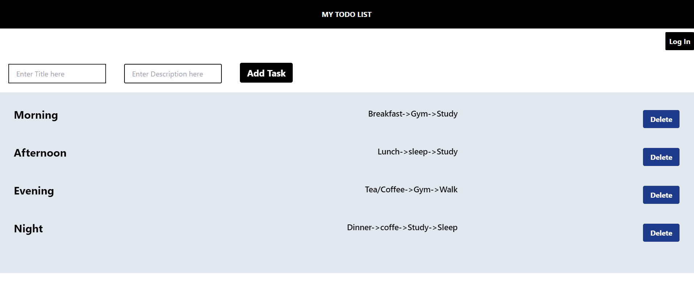

# To Do Application:
 
# Steps for installation
## For React
- npx create vite@latest my-app
- cd my-app
- npm install

## For Tailwind
- npm install -D tailwindcss postcss autoprefixer
- npx tailwindcss init -p
- for more see this `https://tailwindcss.com/docs/guides/vite`

## For React Icons
- npm install react-icons
